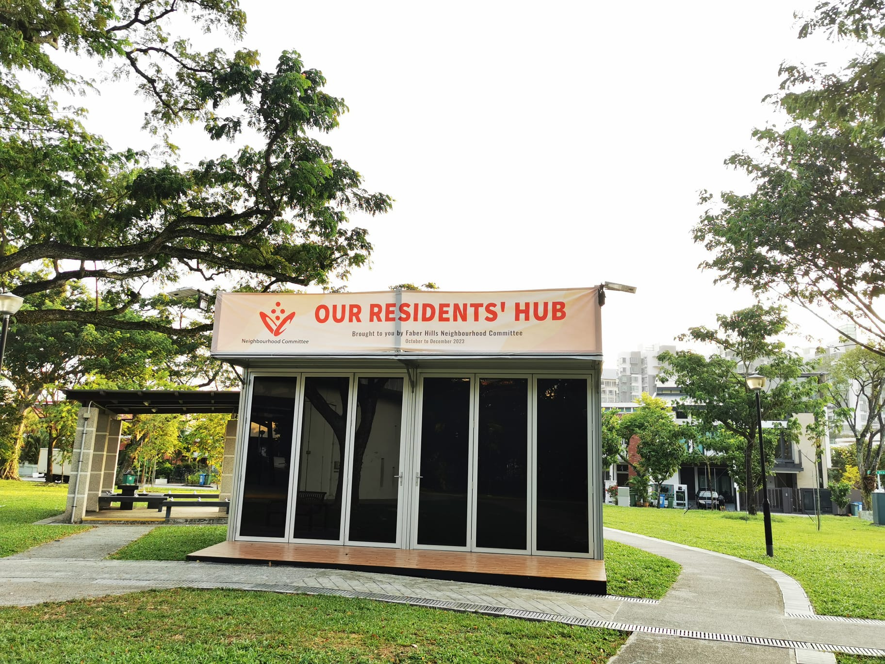

### Welcome to Faber Hills NC Hub

#### Upcoming Activities
From October to December 2023, the Faber Hills Neighbourhood Committee has curated many fantastic activities and workshops for you at Our Residents' Hub, located in the [Faber Hills Playground](https://maps.app.goo.gl/hRiFhogMCZRWxcpX9). Join in the activities for unforgettable experiences!

| Date & Time                          | Events                                               | Registration |
| :--------------------------------- | :--------------------------------------------------- | :------------ |
| Oct 17, 2023 (Tue), 9.30 AM - 11.30 AM | SDO Digital Workshop (Workshop 1 - Basic Phone Features) | Walk in or pre-register at [SDO Talks Registration Form](https://form.gov.sg/6513f9942c8bd900127b82d4) or call 67761670. |
| Oct 18, 2023 (Wed), 8 AM - 9 AM | Keep Fit Marilyn | Walk-in |
| Oct 19, 2023 (Thu), 9 AM | Rummy-O | Walk-in |
| Oct 20, 2023 (Fri), 9 AM - 10 AM | Residents engagement in Hub before and after tree planting | Walk-in |
| Oct 20, 2023 (Fri), 9 AM - 10 AM | Tree planting by Nparks | [Pre-register](https://form.gov.sg/650d54a7020dec0012f43961) |
| Oct 21, 2023 (Sat), 1 PM - 3 PM | Investment Know-how Workshop | Walk-in or check [pre-register](https://share.hsforms.com/1EF60dtE7Ryy-2cuOi4CezAd9t3s) |
| Oct 22, 2023 (Sun), 10 AM - 11 AM | Digital Photography for Beginners | Walk-in.
| Oct 25, 2023 (Wed), 8 AM - 9 AM | Keep Fit Marilyn | Walk-in |
| Oct 25, 2023 (Wed), 10 AM - 11.30 AM | Singalong with Jean | Walk-in |
| Oct 26, 2023 (Thu), 9 AM | Rummy-O | Walk-in |
| Oct 28, 2023 (Sat), 6 PM - 9.30 PM | Faber Hills NC - Halloween 2023 | [Pre-register](https://form.gov.sg/651938f71361df0012924666) |
| Oct 31, 2023 (Tue), 9.30 AM - 11.30 AM | SDO Digital workshop (Workshop 2 - Cybersecurity) | Walk in or [pre-register](https://form.gov.sg/6513f9942c8bd900127b82d4) |
| 1 Nov, 2023 (Wed), 10 AM | Singalong with Jean | Walk-in |
| Nov 2, 2023 (Thu), 9 AM | Rummy-O | Walk-in |
| Nov 3, 2023 (Fri), 7.30 PM - 9 PM | Balloon Sculpting Workshop | Walk-in |
| Nov 4, 2023 (Sat), 10 AM - 11.30 AM | Investment Talk (Part 2) | Walk-in or [pre-register](https://share.hsforms.com/17nf3QTfhREy96Bx20fNmAAd9t3s) |
| Nov 4, 2023 (Sat), 5 PM - 6 PM | Rubix Cube Beginner Class | Walk-in, bring your own 3X3 rubix cube. |
| Nov 5, 2023 (Sun), 3 PM to 5 PM | Ukulele jamming - Learn to play music for fun | Walk-in, no need any music background required. |
| Nov 8, 2023 (Wed), 8 AM - 9 AM | Keep Fit Marilyn | Walk-in |
| Nov 8, 2023 (Wed), 9.30 AM - 11.30 AM | Balik Kampung Module 1.5: Stay Connected | Walk-in or pre-register in Healthy 365 app with HPB code (u1660) |
| Nov 9, 2023 (Thu), 9 AM | Rummy-O | Walk-in |
| Nov 10, 2023 (Fri), 10 AM - 11 AM | Singalong with Jean | Walk-in |
| Nov 11, 2023 (Sat), 3 PM - 5 PM | Learn to play Ukulele | Walk-in | 
| Nov 13, 2023 (Mon), 3 PM - 4 PM | Rubix Cube Beginner Class | Walk-in (Bring your own 3X3 rubix cube.) |
| Nov 13, 2023 (Mon), 4 PM - 5.30 PM | Gaming together - Board Games, Chess etc. | Walk-in | 
| Nov 14, 2023 (Tue), 9.30 AM - 11.30 AM | SDO Digital workshop (Workshop 3 - Singpass) | Walk-in or [pre-register](https://form.gov.sg/6513f9942c8bd900127b82d4) |
| Nov 15, 2023 (Wed), 8 AM - 9 AM | Keep Fit Marilyn | Walk-in |
| Nov 15, 2023 (Wed), 9.30 AM - 11.30 AM | Balik Kampung Module 1: Hey Friends! | Walk-in or pre-register in Healthy 365 app with HPB code (Q5757)  |
| Nov 16, 2023 (Thu), 9 AM | Rummy-O | Walk-in |
| Nov 17, 2023 (Fri), 10 AM – 11 AM | Singalong with Jean | Walk-in | 
| Nov 22, 2023 (Wed), 8 AM - 9 AM | Keep Fit Marilyn | Walk-in |
| Nov 22, 2023 (Wed), 9.30 AM - 11.30 AM | Balik Kampung Module 2: Keep My Brain Active | Walk-in or pre-register in Healthy 365 app with HPB code (F5535) |
| Nov 22, 2023 (Wed), 8 PM to 9 PM | Traditional Chinese Medicine 讲座题目“中医如何提升我们的免疫系统“  | Walk-in |
| Nov 23, 2023 (Thu), 9 AM | Rummy-O | Walk-in |
| Nov 24, 2023 (Fri), 10 AM – 11AM | Singalong with Jean | Walk-in |
| Nov 24, 2023 (Fri), 7.30 PM - 9 PM | Balloon Sculpting Workshop | Walk-in |
| Nov 28, 2023 (Tue), 9.30 AM - 11.30 AM | SDO Digital workshop (Workshop 4 - WhatsApp) | Walk in or [pre-register](https://form.gov.sg/6513f9942c8bd900127b82d4) |
| Nov 29, 2023 (Wed), 8 AM - 9 AM | Keep Fit Marilyn | Walk-in |
| Nov 29, 2023 (Wed), 9.30 AM - 11.30 AM | Balik Kampung Module 3: I Feel Good | Walk-in or pre-register in Healthy 365 app with HPB code (E5811) |
| Nov 30, 2023 (Thu), 9 AM | Rummy-O | Walk-in |
| Dec 1, 2023 (Fri), 10AM – 11AM | Singalong with Jean | Walk-in |
| Dec 1, 2023 (Fri), 7.30 PM - 9 PM | Balloon Sculpting Workshop | Walk-in |
| Dec 2, 2023 (Sat), 10 AM - 11.30 AM | Will writing, Letter of Attorney (LPA), Estate planning session | [pre-register](https://share.hsforms.com/1iMvx2g1HStOJo2Vkdv6jVAd9t3s) |
| Dec 6, 2023 (Wed), 8 AM - 9 AM | Keep Fit Marilyn | Walk-in |
| Dec 6, 2023 (Wed), 9.30 AM - 11.30 AM | Balik Kampung Module 4: I can do this | Walk-in or pre-register in Healthy 365 app with HPB code (I4715) |
| Dec 7, 2023 (Thu), 9 AM | Rummy-O | Walk-in |
| Dec 12, 2023 (Tue), 10 AM - 11.30 AM | SDO Digital workshop (Workshop 5 - E-Payment) | Walk in or [pre-register](https://form.gov.sg/6513f9942c8bd900127b82d4) |
| Dec 13, 2023 (Wed), 8 AM - 9 AM | Keep Fit Marilyn | Walk-in |
| Dec 13, 2023 (Wed), 9.30 AM - 11.30 AM | Balik Kampung Module 5: How am I feeling today | Walk-in or pre-register in Healthy 365 app with HPB code (D7714) |
| Dec 14, 2023 (Thu), 9 AM | Rummy-O | Walk-in |
| Dec 20, 2023 (Wed), 8 AM - 9 AM | Keep Fit Marilyn | Walk-in |
| Dec 20, 2023 (Wed), 9.30 AM - 11.30 AM | Senior Health Curriculum - A4 Let's be strong together | Walk-in or pre-register in Healthy 365 app with HPB code 7 days before activity date.  |
| Dec 21, 2023 (Thu), 9 AM | Rummy-O | Walk-in |
| Dec 22, 2023 (Fri), 7.30 PM - 9 PM | Balloon Sculpting Workshop | Walk-in |
| Dec 27, 2023 (Wed), 8 AM - 9 AM | Keep Fit Marilyn | Walk-in |
| Dec 27, 2023 (Wed), 9.30 AM - 11.30 AM | Senior Health Curriculum - A5 FRIENDS! Together we keep a healthy mind | Walk-in or pre-register in Healthy 365 app with HPB code 7 days before activity date.  |
| Dec 28, 2023 (Thu), 9 AM | Rummy-O | Walk-in |
| Dec 29, 2023 (Fri), 10AM – 11AM | Singalong with Jean | Walk-in |

To get updated to the upcoming Faber Hills NC activities, please join our [Telegram Group](https://t.me/+hV5_Km8F86UwZDQ1) and like our [Facebook Account](https://www.facebook.com/FaberHillsFriends).

For enquiries and feedback, please [email](mailto:wangli1426@gmail.com) us. 
